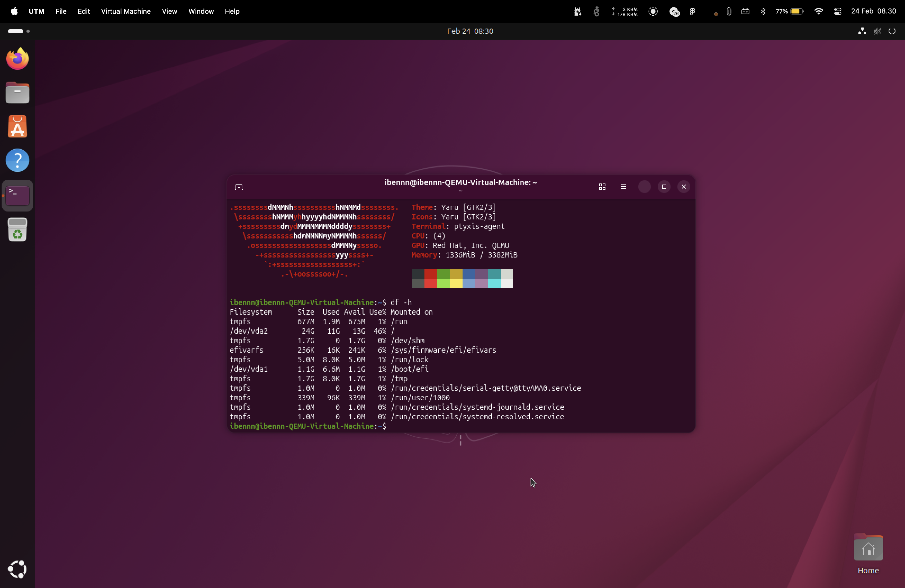
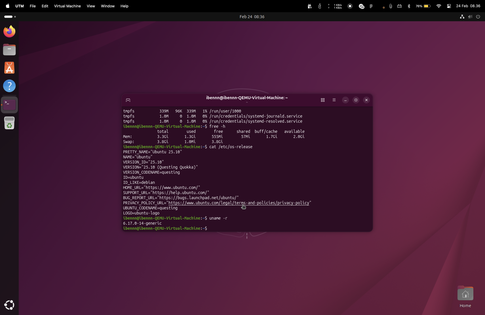
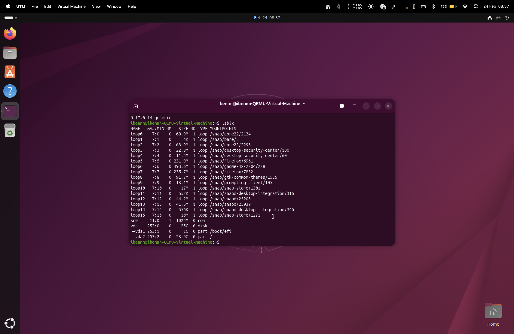
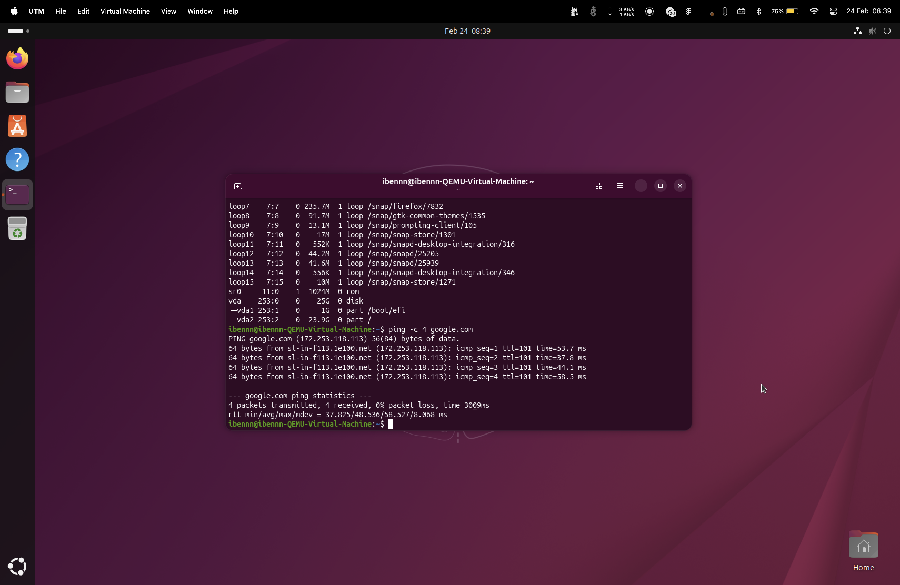

# Jobsheet 1 
## Latihan 1.3 

Hasil Instalasi Ubuntu

## Latihan 1.4
### - Update package list : `sudo apt update`

### - Upgrade packages : `sudo apt upgrade`

### - Install neofetch : `sudo apt install neofetch`

### - Menjalankan perintah : `df -h`

### - Menjalankan perintah: `free -h`

## Latihan 1.5
### - Tampilkan informasi OS : `cat /etc/os-release`

### - Tampilkan versi kernel : `uname -r`

### - List partisi : `lsblk`

### - Check network connectivity : `ping -c 4 google.com`

### - Menjalankan perintah htop : `htop`

### - Laporan singkat
Semua sistem terkonfigurasi dengan lancar. 

## Latihan 1.6
### - Sistem operasi apa yang Anda gunakan sehari-hari? (Windows, macOS,Linux, atau lainnya)
Saya biasa menggunakan sistem operasi macOS.
### - Berapa lama Anda menggunakan sistem operasi tersebut?
Sudah sekitar 1 tahun.
### - Apa yang Anda sukai dari sistem operasi tersebut?
Smooth dan berjalan dengan baik tanpa kendala selama pemakaian.
### - Apa tantangan atau masalah yang pernah Anda hadapi?
Masih belum pernah menghadapi masalah serius, mungkin jika masalah kecil hanya seperti bug yang hanya perlu restart sistem
### - Apakah Anda pernah menggunakan sistem operasi lain? Bandingkan pengalaman Anda.
Pernah, sebelumnya saya menggunakan windows, menurut saya macOS lebih cocok untuk keseharian saya yang hanya digunakan untuk kuliah, tugas tugas, ataupun coding. Namun windows memiliki keunggulan di bidang gaming, hampir semua game compatible untuk sistem operasi Windows. 
### - Setelah mempelajari bab ini, apakah ada sistem operasi lain yang ingin Anda coba? Mengapa?
Tidak ada, karena saya sudah merasakan ketiga OS yakni Windows, macOS, dan Linux, menurut saya yang ternyaman adalah macOS karena cukup stabil bagi saya.