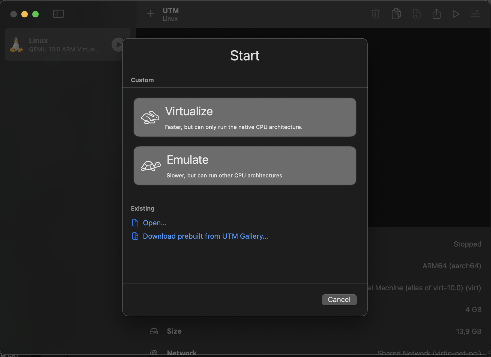
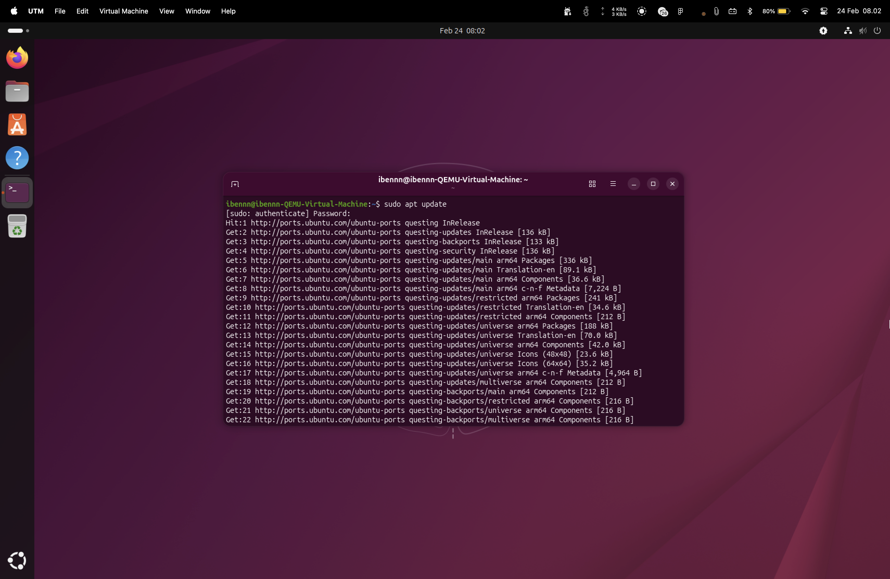
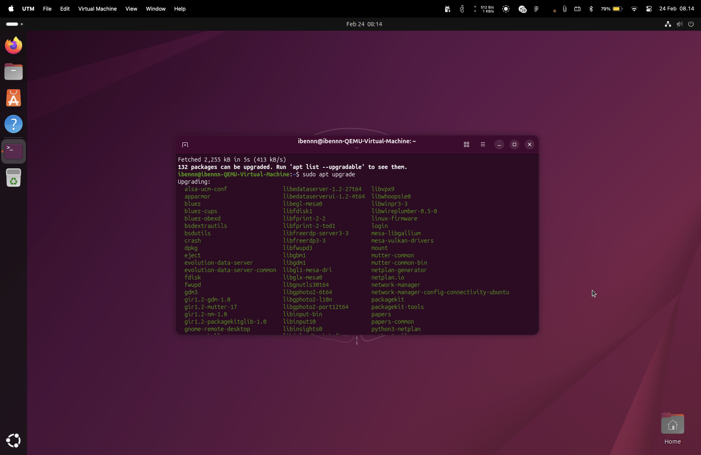
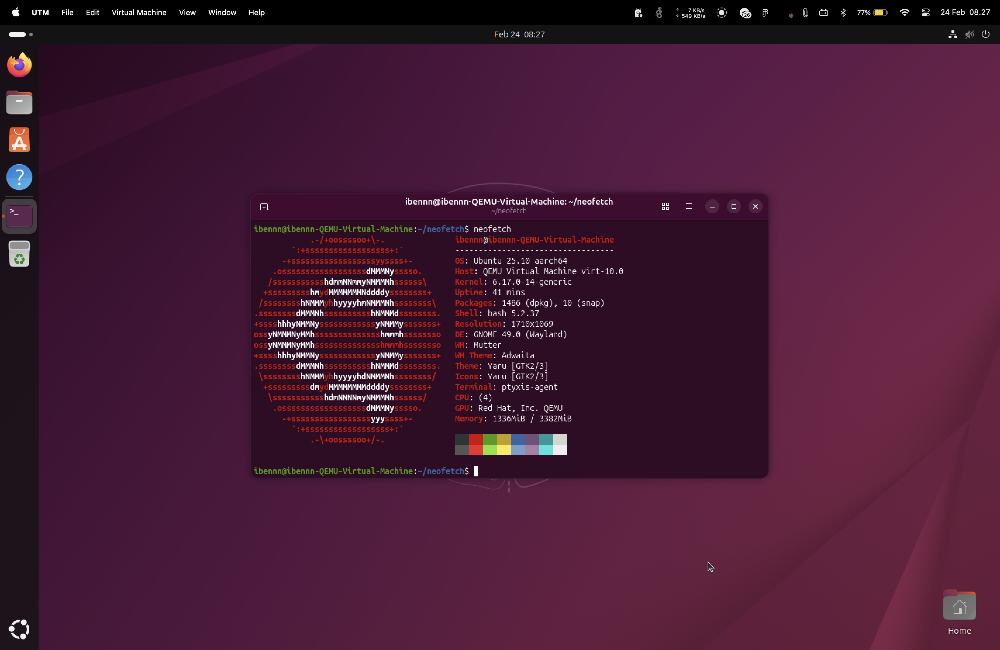
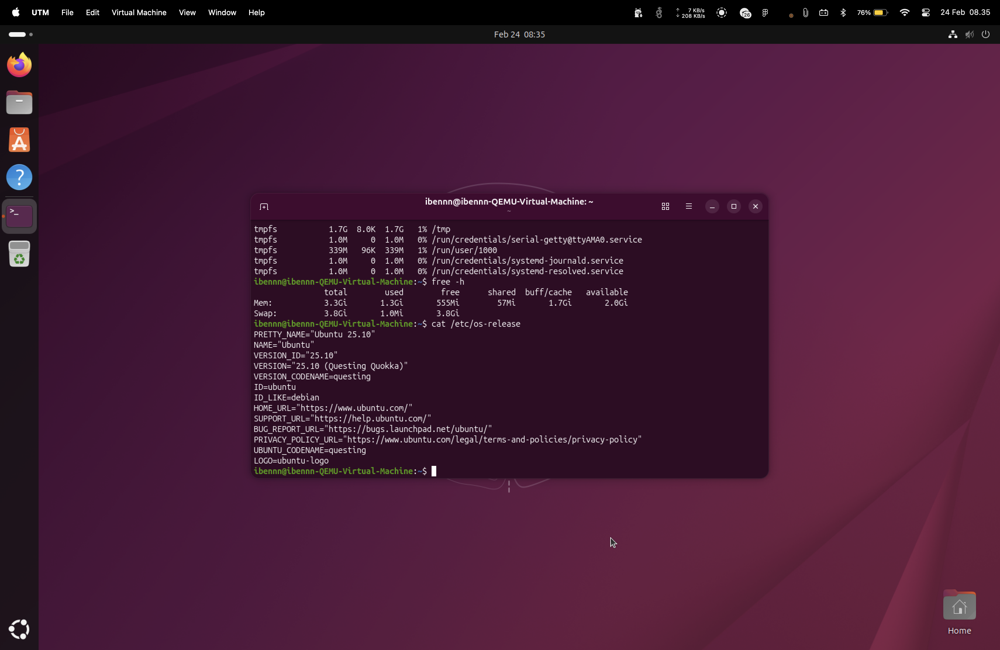
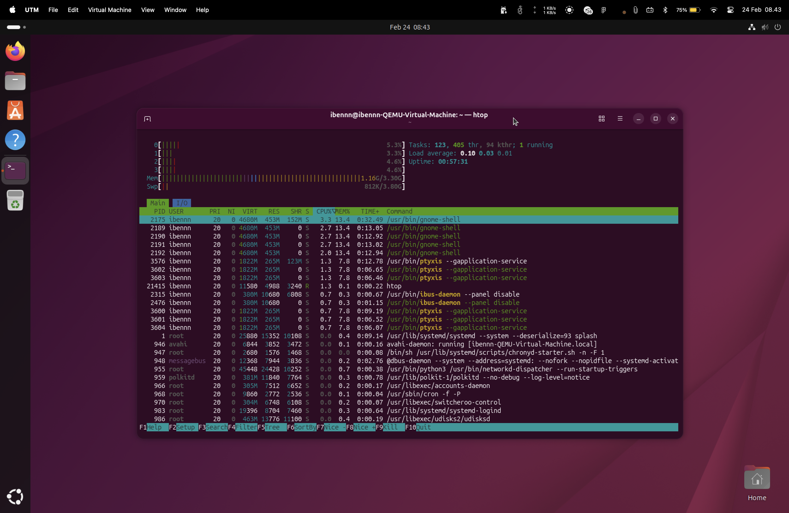

# JOBSHEET 1 - SISTEM OPERASI

> **Mata Kuliah :** Sistem Operasi  
> **Nama :** Ibni Andarta<br>
> **NIM :** 25410702058<br>
> **Kelas :** TI-1G/13

---
## Latihan 1.1
### 5 Fungsi Utama Sistem Operasi (dengan contoh lintas OS)

> Sistem operasi (OS) adalah software inti yang mengelola hardware, software, dan interaksi pengguna dengan komputer.

---

### 1) Manajemen Proses
**Pengertian:**  
OS mengatur siklus hidup proses: membuat, menjadwalkan, memprioritaskan, hingga menghentikan proses.

**Contoh konkret:**
- **Windows:** Task Manager untuk memantau dan mengakhiri proses (mis. Chrome, Word).
- **Linux:** `top`, `htop`, `ps`, dan `kill` untuk monitoring serta terminasi proses.

---

### 2) Manajemen Memori
**Pengertian:**  
OS mengatur penggunaan RAM agar aplikasi berjalan stabil tanpa saling mengganggu.

**Contoh konkret:**
- **macOS:** Activity Monitor menampilkan penggunaan memori aplikasi (mis. Safari, Final Cut Pro).
- **Windows:** Tab **Performance** di Task Manager menampilkan konsumsi RAM secara real-time.

---

### 3) Manajemen Sistem File
**Pengertian:**  
OS mengelola struktur penyimpanan: penamaan, penyimpanan, akses, hingga penghapusan file.

**Contoh konkret:**
- **Windows:** File Explorer untuk membuat folder, memindahkan, dan menghapus file.
- **Linux:** CLI seperti `mkdir`, `cp`, `rm` untuk operasi file/folder.

---

### 4) Manajemen Perangkat Keras
**Pengertian:**  
OS mengontrol perangkat keras (printer, keyboard, GPU, disk) melalui driver.

**Contoh konkret:**
- **Windows:** Device Manager untuk instalasi dan manajemen driver.
- **macOS:** Plug-and-play, misalnya AirPods/printer terdeteksi otomatis.

---

### 5) Antarmuka Pengguna
**Pengertian:**  
OS menyediakan media interaksi user, baik GUI maupun CLI.

**Contoh konkret:**
- **Windows:** GUI melalui Desktop, Start Menu, dan ikon.
- **Linux:** CLI via Terminal serta GUI seperti GNOME/KDE.

---

## Latihan 1.2:
### Analisis: Kapan Sebaiknya Menggunakan Windows vs Linux vs macOS

---
| Use Case | Pilihan Utama | Alasan |
|---|---|---|
| Gaming | **Windows** | Kompatibilitas game dan driver GPU paling luas |
| Development | **Linux / macOS** (tergantung stack) | Linux fleksibel untuk backend/devops, macOS kuat untuk mobile Apple + Unix base |
| Server | **Linux** | Stabil, ringan, otomatisasi kuat, biaya lisensi rendah |
| Creative Work | **macOS / Windows** | macOS unggul stabilitas ekosistem kreatif; Windows unggul opsi hardware/performa |
| Enterprise | **Windows + Linux (hybrid)** | Windows kuat di endpoint/Office/AD, Linux dominan di server/cloud |

---

## Latihan 1.3: Instalasi Ubuntu
### 1. Download Ubuntu -> ([Ubuntu](https://ubuntu.com/download/desktop))
### 2. Download Virtual Machine (*saya menggunakan UTM karena saya menggunakan macOS*) -> ([Virtual Box](https://www.virtualbox.org/wiki/Downloads)) ([UTM](https://mac.getutm.app/))
### 3. Run UTM dan klik Add 
kemudian sesuaikan spesifikasi yang akan diberikan ke virtual machine sesuai yang dibutuhkan dan pilih ISO Ubuntu yang sudah di download
### 4. Install kemudia run ubuntu


---

## Latihan 1.4: Manajemen Paket dan Sistem

### Update Package List
```bash
sudo apt update
```


### Upgrade Packages
```bash
sudo apt upgrade
```


### Install Neofetch
```bash
sudo apt install neofetch
```


### Menjalankan Perintah df -h
```bash
df -h
```


### Menjalankan Perintah free -h
```bash
free -h
```


---

## Latihan 1.5: Informasi Sistem

### Tampilkan Informasi OS
```bash
cat /etc/os-release
```


### Tampilkan Versi Kernel
```bash
uname -r
```


### List Partisi
```bash
lsblk
```


### Check Network Connectivity
```bash
ping -c 4 google.com
```


### Menjalankan Perintah htop
```bash
htop
```


### Laporan Singkat
> ✅ **Semua sistem terkonfigurasi dengan lancar.**

---

## Latihan 1.6: Refleksi Pengalaman Sistem Operasi

### 1. Sistem operasi apa yang Anda gunakan sehari-hari? (Windows, macOS, Linux, atau lainnya)
**Jawab:** Saya biasa menggunakan sistem operasi macOS.

### 2. Berapa lama Anda menggunakan sistem operasi tersebut?
**Jawab:** Sudah sekitar 1 tahun.

### 3. Apa yang Anda sukai dari sistem operasi tersebut?
**Jawab:** Smooth dan berjalan dengan baik tanpa kendala selama pemakaian.

### 4. Apa tantangan atau masalah yang pernah Anda hadapi?
**Jawab:** Masih belum pernah menghadapi masalah serius, mungkin jika masalah kecil hanya seperti bug yang hanya perlu restart sistem.

### 5. Apakah Anda pernah menggunakan sistem operasi lain? Bandingkan pengalaman Anda.
**Jawab:** Pernah, sebelumnya saya menggunakan Windows. Menurut saya macOS lebih cocok untuk keseharian saya yang hanya digunakan untuk kuliah, tugas-tugas, ataupun coding. Namun Windows memiliki keunggulan di bidang gaming, hampir semua game compatible untuk sistem operasi Windows.

### 6. Setelah mempelajari bab ini, apakah ada sistem operasi lain yang ingin Anda coba? Mengapa?
**Jawab:** Tidak ada, karena saya sudah merasakan ketiga OS yakni Windows, macOS, dan Linux. Menurut saya yang ternyaman adalah macOS karena cukup stabil bagi saya.

---

*Jobsheet 1 - Sistem Operasi*
